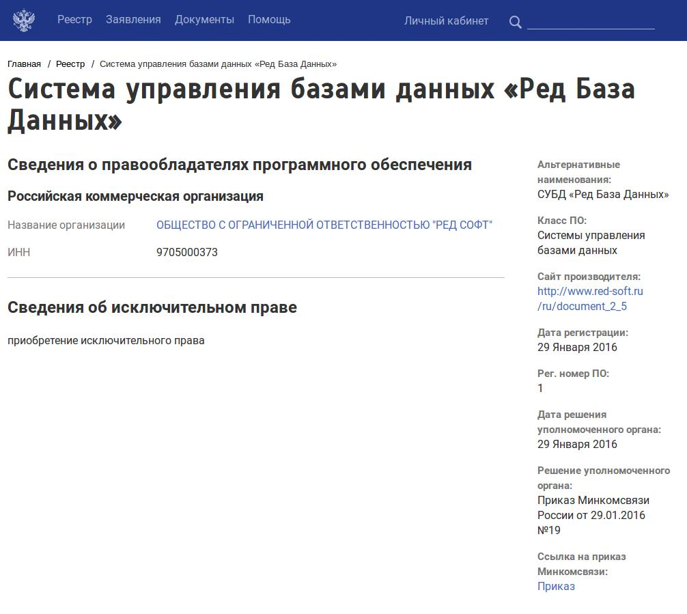
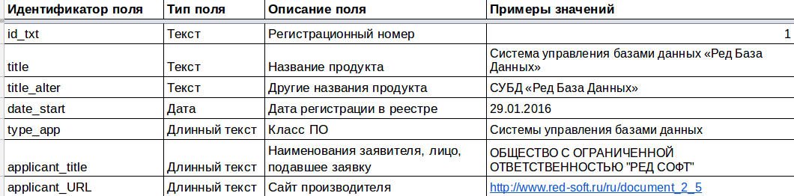

Автоматический веб-агрегатор для создания единой базы сертифицированных средств защиты информации
=================================================================================================
- Задание для летней практики 2017

Приложение - консольное.

Чтобы запустить программу, необходимо написать следующие команды в терминале:
```angular2html
git clone https://github.com/moskanka/DataMining
./get-reestr-mtmc.sh
```

В процессе работы приложение заходит на [сайт Единого реестра российских
программ для ЭВМ и БД](https://reestr.minsvyaz.ru/reestr/) и собирает оттуда необходимую информацию. 
Результаты записываются в файл `reestr.csv`, а так же выдаются прямо в консоль в 
`csv`-формате 

Кодировка `csv`-файла: UTF-8 без BOM.

Ошибки выдаются в отдельном потоке - `stderror`

**Пример работы программы для одной из программ реестра:**

- Страница продукта:


- Выходной `csv`-файл:


- Если во входных данных нет искомого поля, то в него ставится значение по умолчанию, а 
если оно не оговоренно, то поле оставляется пустым.

**Документация функций и классов:**

Чтобы открыть документацию к этому приложению необходимо написать в терминале
(находясь в корневой папке проекта):
```angular2html
doxygen Doxyfile
cd html
gnome-open index.html
```
Так же можно вручную открыть файл index.html в удобном вам браузере.
